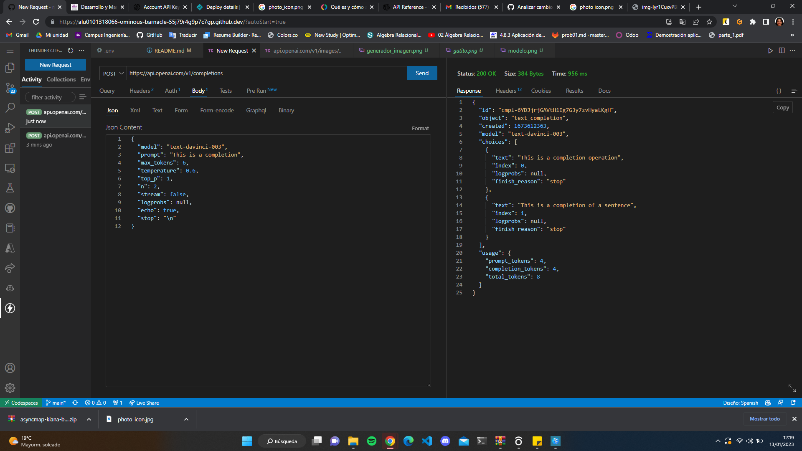
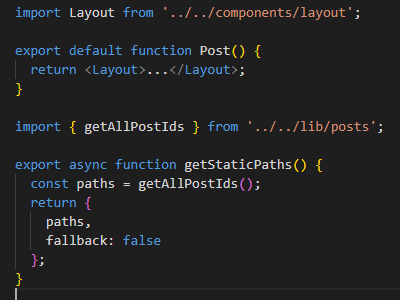
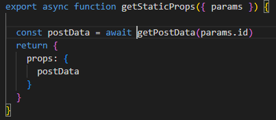

# PRÁCTICA - NETX.JS

- [PRÁCTICA - NETX.JS](#práctica---netxjs)
  - [1. Generador de nombres](#1-generador-de-nombres)
  - [2. Generador de imágenes](#2-generador-de-imágenes)
  - [3. Despliegue en Netlify](#3-despliegue-en-netlify)
  - [4. Separación código en varios ficheros](#4-separación-código-en-varios-ficheros)
  - [5. Ejercicios REST](#5-ejercicios-rest)
  - [6. Ejercicio de Rutas Dinámicas](#6-ejercicio-de-rutas-dinámicas)

## 1. Generador de nombres
Para el generador de nombres debemos mdodifcar el código de index.js. Para hacer la petición a la API de OpenAI y escribir con POST a espera de una respuesta necesitamos el siguiente código:

Primero completamos el código para la página generadora de nombres de index.js. 
Un ejemplo del funcionamiento es el siguiente:

## 2. Generador de imágenes
Para el generador de imágenes debemos modificar el código de index.js y crear en la carpeta /pages/api/ otro fichero para acceder a la generación de imágenes. Para hacer la petición a la API de OpenAI y escribir con POST a espera de una respuesta necesitamos este código en /pages/pai/images.js:

Luego para adaptar el índice a la salida esperada cambiamos el texto para solicitar qué imagen quiere el cliente y finalmente la imprimimos por pantalla.

Un ejemplo del funcionamiento es el siguiente:

## 3. Despliegue en Netlify
Se puede ver el despliegue en Netlify [pinchando aqui](https://coruscating-salamander-187647.netlify.app/):

## 4. Separación código en varios ficheros
Primero creamos el índice en index.js:

Los enlaces dentro del índice nos llevan a siguientes páginas: **/image**, **/pet**, **/404** que son los generadores de imagen y nombres y la página de error. 

La página *image* contiene el código realizado anteriormente para la creación de imágenes, mientras que la página *pet* contiene el código realizado anteriormente para la creación de nombres. La página 404 contiene el siguiente código:

Además, se les ha incluido a las páginas *image* y *pet* un enlace para volver a la página de inicio:

Visualización de los nombres en las pestañas de las ventanas:

Finalmente mostramos el despliegue:

## 5. Ejercicios REST
1. Todos los modelos:

2. Información sobre un modelo:

3. Generador de una imagen:

La imagen generada es la siguiente:

4. Completar una frase:

5. Moderación (clasifica si el texto viola el OpenAI's Content Policy):

## 6. Ejercicio de Rutas Dinámicas
Los siguientes ejercicios tratan de seguir un curso para entender las rutas dinámicas. Primero nos indica que vamos a aprender:

Luego es necesario descargar el repositorio donde completaremos los ejercicios propuestos:

Nos recomienda personalizar la página para entender el código del mismo:

Creamos [id].js para empezar a usar las rutas dinámicas. Para ello tenemos que modificar el código en post.js:

Continuamos haciendo la página más completa a través de la modificación de algunos ficheros:

Añadimos la fecha actual de la página:

Le damos un poco de formato a la página haciendo uso de CSS:

Planteamiento de una cuestión sobre lo aprendido:

